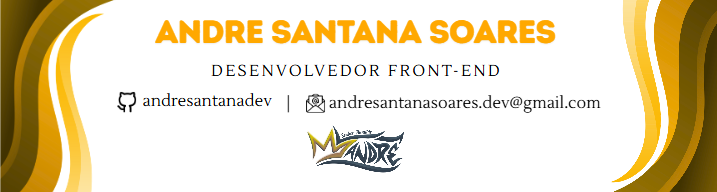

  

# Olá! Eu sou André Santana 👋

### Sou um desenvolvedor Front-End apaixonado por criar soluções inovadoras.

  
  
  

---

### 📊 Linguagens Mais Usadas

  

---

### 💻 Tecnologias e Habilidades

<table>
  <tr>
    <td valign="top" width="50%">
      <h3>Front-End</h3>
      

        
        
        
        
        
        
        
      

    </td>
    <td valign="top" width="50%">
      <h3>Back-End</h3>
      

        
        
        
        
        
      

    </td>
  </tr>
  <tr>
    <td valign="top" width="50%">
      <h3>Banco de Dados</h3>
      

        
      

    </td>
    <td valign="top" width="50%">
      <h3>Hardware e IoT</h3>
      

        
        
        
      

    </td>
  </tr>
  <tr>
    <td valign="top" width="50%">
      <h3>Ferramentas e Servidores</h3>
      

        
        
        
        
        
      

    </td>
    <td valign="top" width="50%">
      <h3>Design e Modelagem 3D</h3>
      

        
        
        
      

    </td>
  </tr>
</table>
